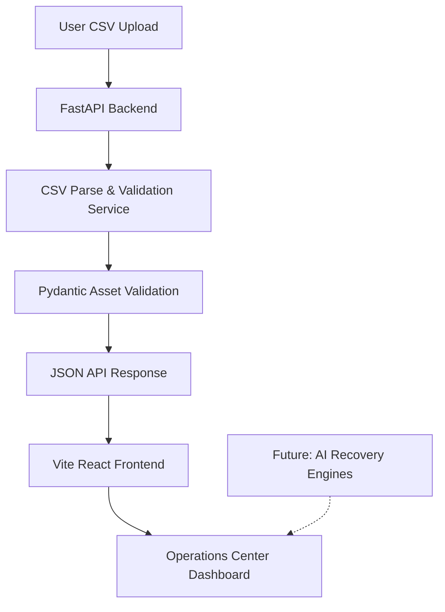

# ReviveOps AI - Architecture

This document describes the technical architecture of the **ReviveOps AI** Recovery Operations Center.

## System Overview



### Current Active Architecture (Foundation Milestone)
1. **Frontend Dashboard**:
   - Single Page App (SPA) built with React, TypeScript, and Vite.
   - Custom styling using Tailwind CSS v3 and shadcn/ui components (`Button`, `Table`, `Card`).
   - Drag-and-drop file interface for loading inventory files.
2. **Backend API**:
   - FastAPI server running on Uvicorn.
   - Handles CORS requests from Vite.
   - Exposes POST `/api/upload` to parse inventory files in real time.
3. **Data Parsing Service**:
   - Standardizes header mapping (case-insensitive, whitespace-trimmed).
   - Validates data types (casts `ID` and `AGE` to integers, `ESTIMATED_REPAIR_COST` to floats).
   - Returns structured JSON to the client.

### Target Production Architecture (Future Milestones)
1. **Recovery Assessment Unit**:
   - Assesses asset condition severity and feasibility.
2. **Recovery Decision Unit**:
   - Utilizes LangChain and Groq (Llama 3.3) to make Repair, Reuse, Recycle, Resell, or Scrap decisions.
3. **Recovery Priority Unit**:
   - Computes recovery efficiency ratings.
4. **Recovery Operations Unit**:
   - Orchestrates the daily recovery timeline.

---

## Workspace Structure

### Backend
```
backend/
├── app/
│   └── main.py          # FastAPI application, CORS middleware, Pydantic models, and CSV parsing
├── venv/                # Local Python virtual environment
└── requirements.txt     # Python dependencies (FastAPI, Uvicorn, Python-multipart, Pydantic)
```

### Frontend
```
frontend/
├── src/
│   ├── components/
│   │   └── ui/          # shadcn components (button, card, table)
│   ├── lib/
│   │   └── utils.ts     # Styling utilities (cn class merger)
│   ├── App.tsx          # Main Dashboard and state management
│   ├── index.css        # Tailwind directives and oklch theme variables
│   └── main.tsx         # React root mounting
├── tsconfig.json        # TypeScript configuration (resolved path mapping aliases)
├── tailwind.config.js   # Tailwind class paths and theme variables
└── vite.config.ts       # Vite config (path resolving alias '@' -> 'src/')
```

---

## Technology Stack

- **Frontend SPA**: React (v19), TypeScript, Vite (v8), Lucide Icons
- **UI Components**: shadcn/ui, Tailwind CSS (v3)
- **Backend API**: Python (v3.11), FastAPI (v0.139), Uvicorn (v0.51)
- **Deployment Targets**: Frontend -> Vercel, Backend -> Render
